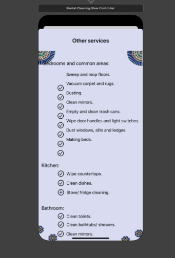
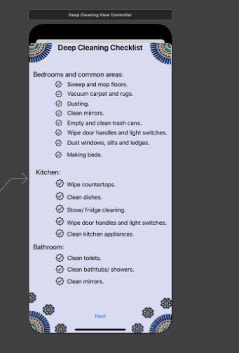

## How to use Cleaneo App

# Simple Cleaning
What's included

##BEDROOM, LIVING ROOM & COMMON AREAS
Sweep and mop floors
Vacuum carpet and rugs
Dusting
Clean mirrors
Take out the trash
Stove cleaning
Empty and clean trash cans
Wipe door handles & light switches
Dust windows, sills, and ledges
Making Beds (Airbnb Cleaning Only)

##KITCHEN
Stove cleaning
Wipe countertops
Wipe door handles & light switches
Cleaning Dishes (Airbnb Cleaning Only)

##BATHROOM
Clean toilets
Clean mirrors
Baththubs/Showers

# Deep Cleaning
What's included

##BEDROOM, LIVING ROOM & COMMON AREAS
Sweep and mop floors
Vacuum carpet and rugs
Dusting
Clean mirrors
Take out the trash
Stove cleaning
Empty and clean trash cans
Wipe door handles & light switches
Dust windows, sills, and ledges
Making Beds (Airbnb Cleaning Only)

##KITCHEN
Stove cleaning
Wipe countertops
Wipe door handles & light switches
Wipe Baseboards
Extra attention to outside of kitchen appliances
Cleaning Dishes (Airbnb Cleaning Only)

##BATHROOM
Clean toilets
Clean mirrors
Bathtubs/Showers
Extra attention to shower and bathroom

# Move in/out Cleaning
What's included

##BEDROOM, LIVING ROOM & COMMON AREAS
Sweep and mop floors
Vacuum carpet and rugs
Dusting
Clean mirrors
Take out the trash
Stove cleaning
Empty and clean trash cans
Wipe door handles & light switches
Dust windows, sills, and ledges
Making Beds (Airbnb Cleaning Only)

##KITCHEN
Stove cleaning
Wipe countertops
Wipe door handles & light switches
Wipe Baseboards
Extra attention to outside of kitchen appliances
Interior cabinet cleaning
Inside fridge
Inside oven
Cleaning Dishes (Airbnb Cleaning Only)

##BATHROOM
Clean toilets
Clean mirrors
Baththubs/Showers
Extra attention to shower and bathroom

# Others
A simple way of living

### Support or Contact

Having trouble with Pages? Check out our [documentation](https://docs.github.com/categories/github-pages-basics/) or [contact support](https://support.github.com/contact) and we’ll help you sort it out.
